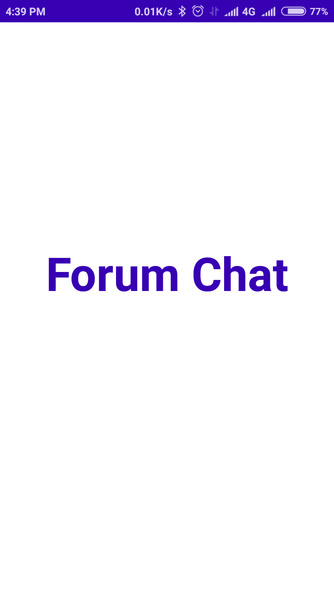
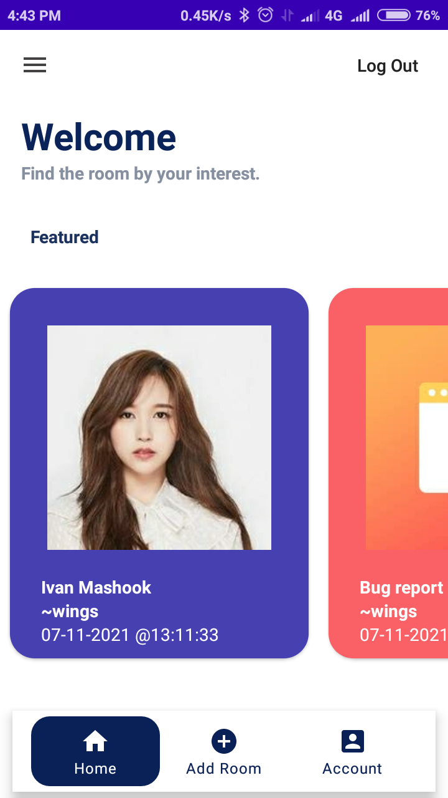
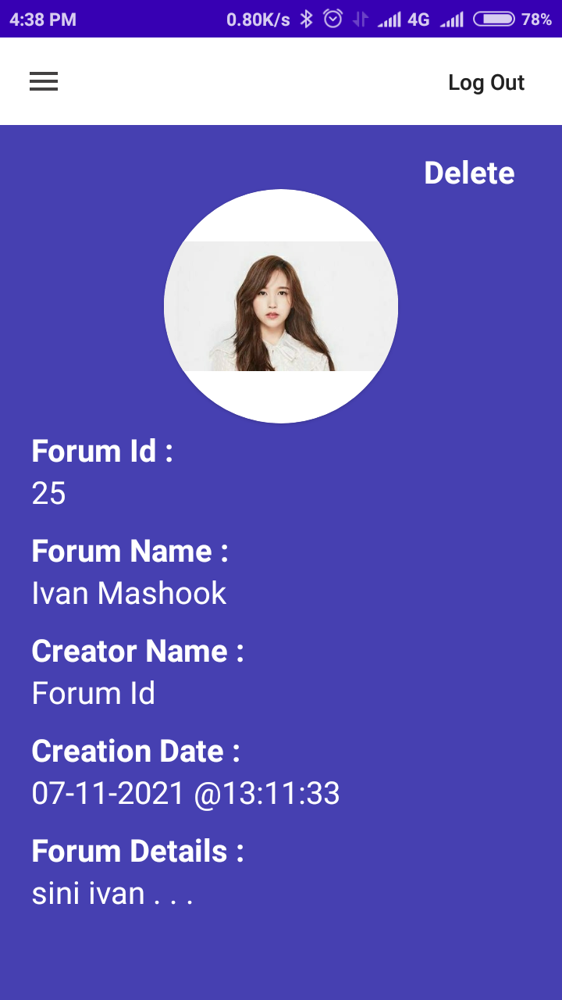
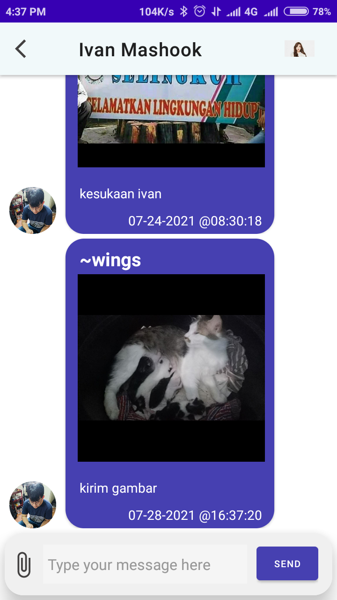

# Vanrr_ForumChat-Android
a Forum Chat Room App

Vanrr forum chat is a self managed mobile app and backend stack (php-sql)
Mainly it's a public forum chat which all user can participate
This app is still in before alpha
Started as initial project
  

Screenshot_2021-07-28-16-39-29-344_vanrrtech.app.forumchat.png

About BadCode.

BadCode is just a developer name for me to name the app study.
BadCode is obtained through sloppy design and lack of maintainability of the code.
the code of the app complexity should limited to low and medium.
Each of app is developed on purposed to be developed/combined into other functionality

Mainly for personal research,
may publish the app publicly if i feel it hehe . . .

Cheers ...

# How to operate

How to operate:

Always sign in First, just like any other app that use integrated google sign in

You will see all available room chats that you can enter, 
Quick touch on the room card to enter chat
Or long click to show card detail

Whenever the room long clicked it show a bottom sheet detail screen

This is the room chat

